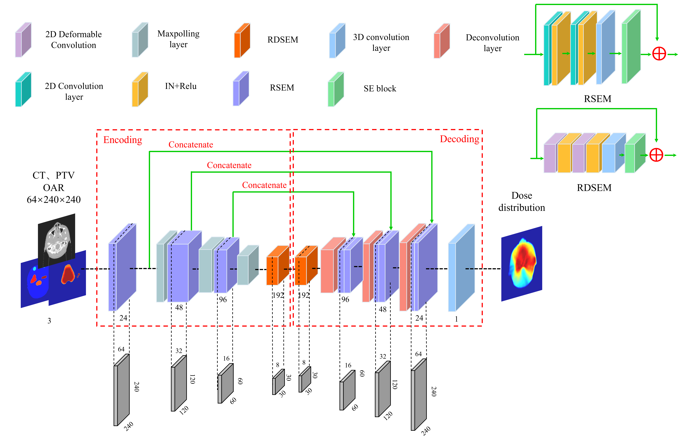

[](https://www.python.org/downloads/release/python-380/)

</a>

# D-UNet
This is the official PyTorch implementation of the D-UNet dose prediction algorithm from "Dose Prediction Using 2.5D Deformable Convolutional Network for Nasopharyngeal Carcinoma" (Yanhua Liu, Wang Luo, Min Liu, Feng Yang, Hongjuan Yang, 2023).

The novel 2.5D Deformable UNet, named D-UNet, for the automatic prediction of dose distribution using computer tomography (CT) images, masks of planning target volumes (PTVs) and organs at risk (OARs).




# Parameters
- `epochs`: Select the maximum number of epochs to train. Default to 300.
- `step-size`: Select the maximum number of epochs to train. Default to 40.
- `batch_size`: Select the batch size of network for the training phase. Default to 1.
- `gamma`: Select the gamma parameter of learning rate decay. Default to 0.4.
- `resume`: Path to load the pre-trained model.
- `learning-rate`: Selelct the initial (base) learning rate. Default to 1e-4.
- `data-dir`: Training data path.
- `checkpoint-path`: Model save path.
- `log-path`: Select a folder to save training logs to.
- `model`: Select the dose prediction model. Default to 'D-UNet'.
- `unique_name`: Define an experiment name. Default to 'exp1'.
- `weight_decay`: The weight attenuation coefficient of the optimizer. Default to 1e-4. 
- `gpu`: Select the GPU to use. Default to cuda:0.
- `training parameter`: Select the training model for testing. Default to 'best.pth'. 
- `test-dir`: Testing data path.

# Start Training
Ensure all requirements from the `Parameters` are met.

To start training, run `train.py`. The training process will be logged into the `./log` directory.

# Example

This is an example file for training a `D-UNet` model:

```yml
epochs: 300
step-size: 40
batch_size: 1
gamma: 0.4
resume: False
learning-rate: 1e-4
data-dir: <path-to-train_set>
checkpoint-path: './checkpoint/'
log-path: './log/'
model: 'D-UNet'
unique_name: 'exp1'
weight_decay: 1e-4.
gpu: 0
training parameter: 'best.pth'
test-dir: <path-to-test_set>
```
